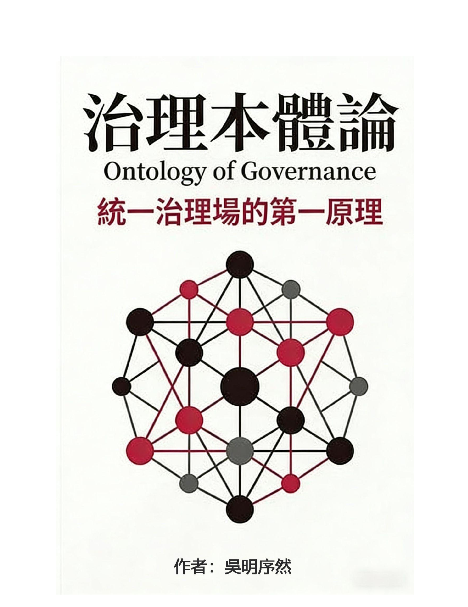
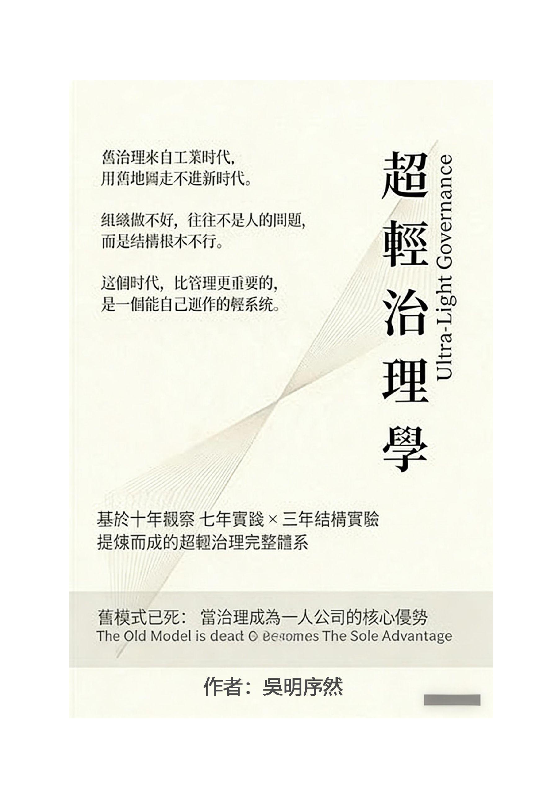
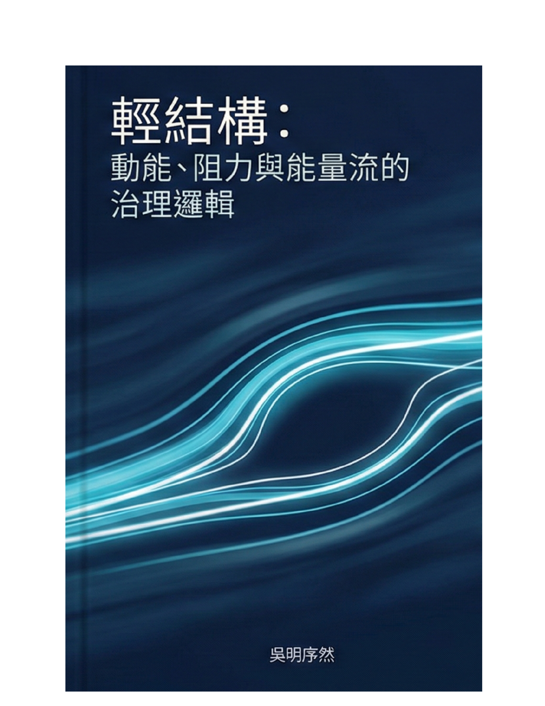
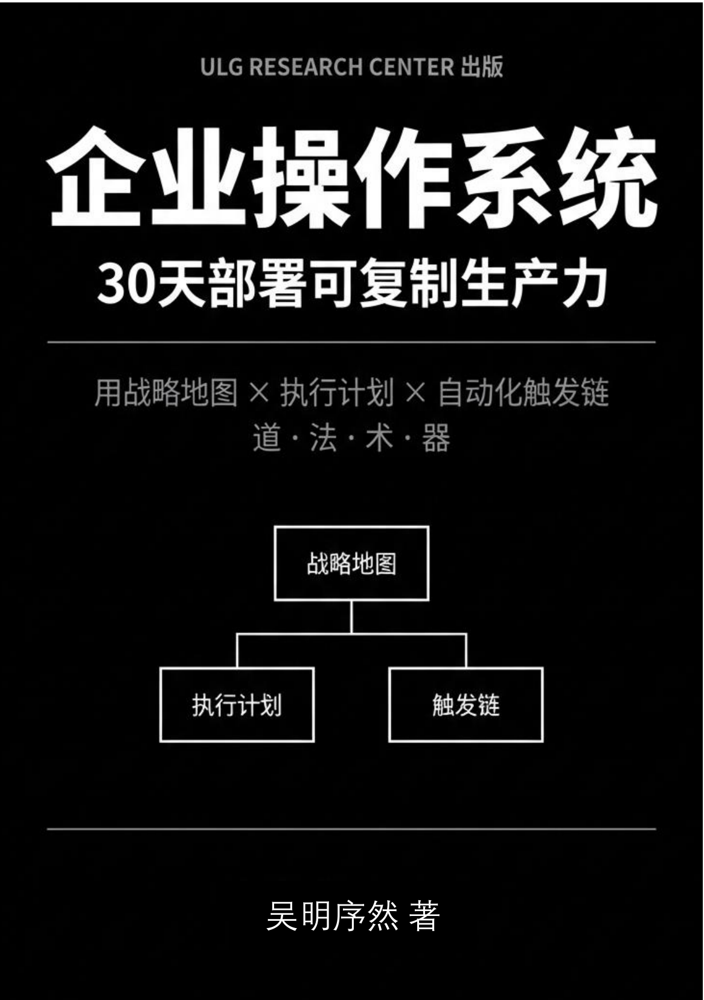
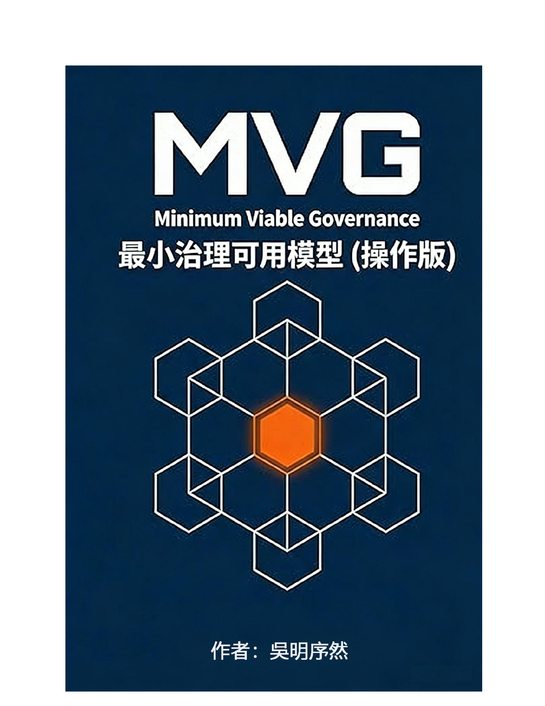
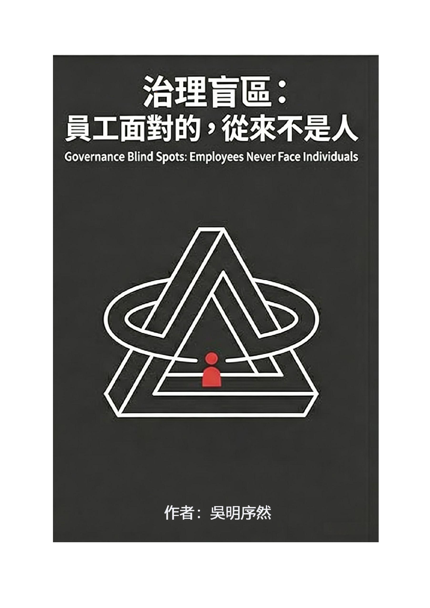
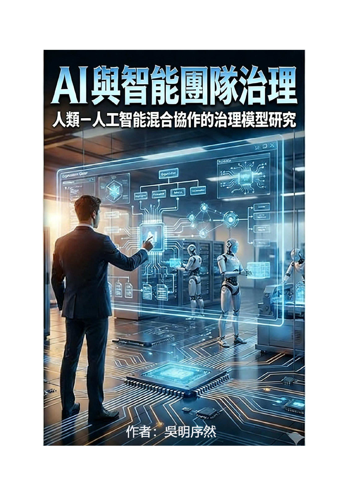
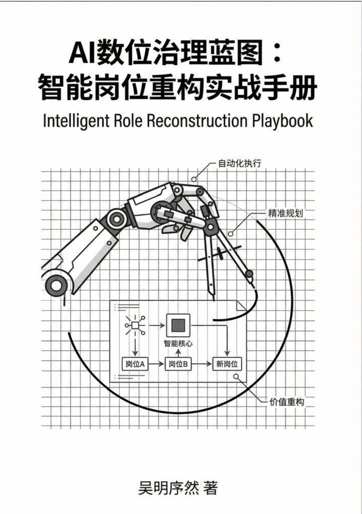
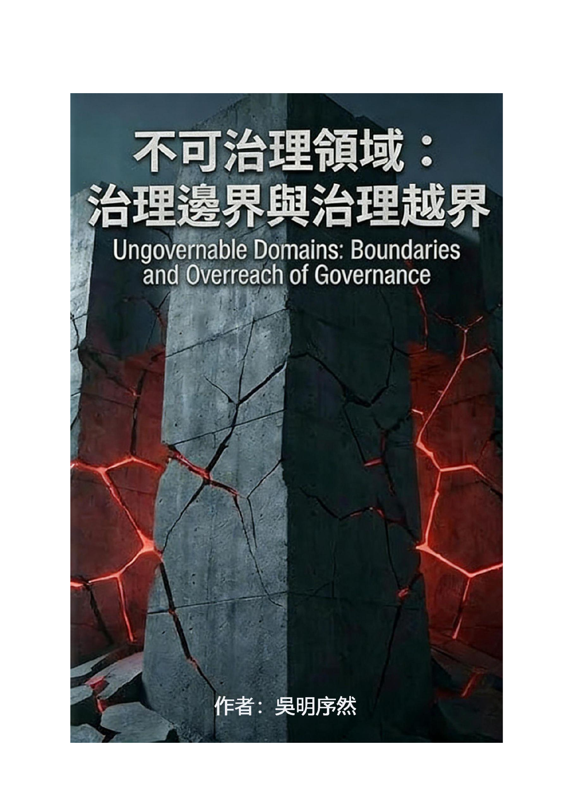
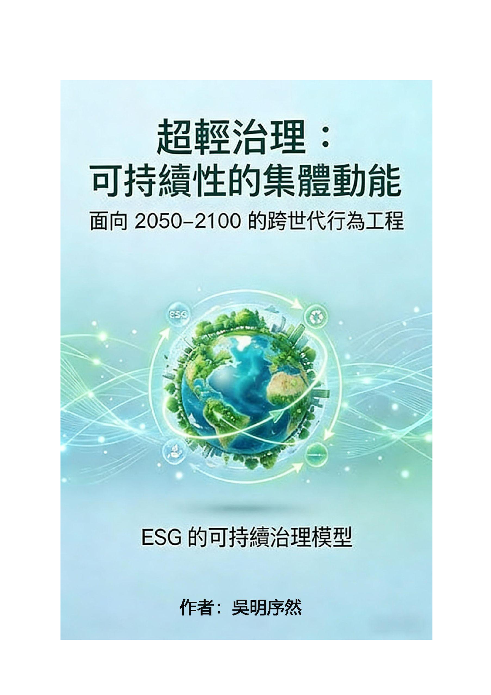

# ULG Research Center — Publications

**Ultra-Light Governance (ULG)** is an original governance research framework developed by **Ng Tick Kee (吴明序然)**, author of 36+ published works spanning governance ontology, organizational structure, AI-human hybrid collaboration, ESG sustainability, and enterprise systems.

> "治理不是管理。管理是盯人，治理是结构化承诺。"
> "Governance is not management. Management is about people. Governance is structural commitment."

Core formula: **G = V x S x C** (Governance = Velocity x Space x Connection)

---

## Complete Book Catalogue (10 Titles)

### Foundational Theory



#### 1. 治理本體論 — 統一治理場的第一原理
**Ontology of Governance — First Principles of the Unified Governance Field**

The theoretical bedrock of the entire ULG system. Asks a fundamental question: is governance a natural phenomenon rather than a human invention? Establishes three governance base forces (S/V/F) and constructs a 12-dimensional Unified Governance Field. Not a management book — a meta-framework explaining *why* governance works the way it does.

> 2025 | Traditional Chinese

<br clear="both" />



#### 2. 超輕治理學
**Ultra-Light Governance**

The complete ULG system — distilled from 10 years of observation, 7 years of practice, and 3 years of structural experimentation. When governance becomes the sole advantage of a one-person company. Covers energy flow, structural weight, behavioral density, and why lighter governance structures outperform heavy ones.

> "旧模式已死：当治理成为一人公司的核心优势"

> 2026 | Traditional Chinese

<br clear="both" />



#### 3. 輕結構：動能、阻力與能量流的治理邏輯
**Light Structure — Momentum, Resistance, and Energy Flow in Governance**

Explores the invisible forces that shape organizations: momentum, potential energy, resistance, leakage, reverse flow, and structural friction. Governance is not about processes — it's about the relationship between structure and flow. When energy flows smoothly, organizations move naturally; when structure is light, individuals advance without being dragged by tasks.

> "治理真正该处理的，不是流程，而是结构与能量的关系。"

> 2026 | Traditional Chinese

---

### Applied Governance

<br clear="both" />



#### 4. 企业操作系统 — 30天部署可复制生产力
**Enterprise Operating System — Deploy Replicable Productivity in 30 Days**

Not a book — a deployment manual. Structured as 道·法·术·器·局 (Philosophy · Methodology · Tactics · Tools · Integration). Includes 24-tool matrix, 27 core templates, and a day-by-day 30-day Game Plan. For SME owners trapped in the "time black hole" of doing everything themselves.

> ISBN: **978-629-94966-0-1** | CIP: Perpustakaan Negara Malaysia

- [Full Table of Contents](books/enterprise-os/TABLE_OF_CONTENTS.md)
- [Preview: Foreword + Chapter 1](books/enterprise-os/preview-chapter-1.md)

> 2026 | Simplified Chinese

<br clear="both" />



#### 5. MVG：最小治理可用模型（操作版）
**Minimum Viable Governance — Operational Edition**

The practical core of ULG. If governance isn't about adding weight but removing friction — what is the smallest unit of governance that can make a system run? Born from 12+ years of observing organizations, micro-teams, one-person companies, and SMEs. All blockages are structural, not human. All fatigue comes from excessive governance weight, not excessive work.

> 2026 | Traditional Chinese

<br clear="both" />



#### 6. 治理盲區：員工面對的，從來不是人
**Governance Blind Spots — Employees Never Face Individuals**

A governance adjudication text. Not management advice, not a survival guide. Redefines: which situations still constitute governance, and which have lost governance legitimacy. Four principles: governance is not natural justice; governance does not equal loyalty; not all systems deserve repair; exit can be the highest governance judgment.

> 2025 | Traditional Chinese | Published by ULG Research Center

---

### AI & Digital Governance

<br clear="both" />



#### 7. AI 與智能團隊治理 — 人類–人工智能混合協作的治理模型研究
**AI & Intelligent Team Governance — Governance Models for Human-AI Hybrid Collaboration**

Builds a Hybrid Governance Model for the next 20-50 years. Redefines roles, boundaries, and decision positions between humans and AI. Covers hybrid behavioral density (V×S×C in AI era), flow-based governance, MVG for AI teams, rhythm systems, risk governance (Bias Triangle, Error Propagation Chain), and the UAG (Ultra-Light AI Governance) roadmap.

- [Full Table of Contents](books/ai-governance/TABLE_OF_CONTENTS.md)
- [Preview: Chapter 1](books/ai-governance/preview-chapter-1.md)

> 2026 | Traditional Chinese

<br clear="both" />



#### 8. AI 数位治理蓝图：智能岗位重构实战手册
**Intelligent Role Reconstruction Playbook**

From manual processes to automated systems — a 90-day enterprise implementation path. Practical playbook for reconstructing job roles around AI capabilities. How to identify which roles expand, which compress, and which transform entirely when AI enters the workplace.

> 2026 | Simplified Chinese | Published by ULG Research Center

---

### Boundary & Sustainability

<br clear="both" />



#### 9. 不可治理領域：治理邊界與治理越界
**Ungovernable Domains — Boundaries and Overreach of Governance**

The "negative theology" of governance. When governance has crossed its conditions of validity, and governance itself has become harmful, someone must dare to adjudicate "stop." This book is not about giving up — it's about structural judgment. Uses threshold theory to define where governance ends and overreach begins.

> 2026 | Traditional Chinese

<br clear="both" />



#### 10. 超輕治理：可持續性的集體動能
**Sustainable Governance Through Ultra-Light Structures — ESG for 2050-2100**

A cross-generational behavioral engineering text. Sustainability is not policy compliance — it's long-cycle behavioral phenomena. Reframes ESG through the ULG lens: density × rhythm × nodes. When behavior is frequent enough, stable enough, and collectible enough, sustainability happens naturally. Not prescribing "what to do" but understanding "how behavior occurs."

> 2025 | Traditional Chinese

---

<br clear="both" />

---

## Governance Framework

- [G = V x S x C — The ULG Governance Formula](framework/G-equals-VxSxC.md)

---

## About the Author

**吴明序然 (Ng Tick Kee / Dicky)**

Independent scholar. Inventor of the ULG (Ultra-Light Governance) system. Enterprise OS architect.

Long-term researcher of SME operational systematization. Dedicated to transforming top-level governance logic into deployable 30-day frameworks. Has independently completed 36 works in the ULG series.

Core thesis: *"Governance is not management. Management is about people. Governance is structural commitment."*

Digital evolution roadmap: **Digitization → Automation → Intelligence → Super Intelligence**

Currently building **99Pages** — an AI-powered Business Operating System serving students and SMEs at RM99/year. 6-app Telegram ecosystem, 23 live micro-services, 155 AI agents.

**Affiliations:**
- ULG Research Center — Research & Publishing
- UIBC Training Hub — Training & Technology
- 99Pages — AI Micro-Services Platform

**Contact:**
- Website: [ulgresearchcenter.com](https://ulgresearchcenter.com)
- Email: ask@ulgresearchcenter.com
- LinkedIn: [UIBC Training Hub](https://www.linkedin.com/uibctraining)
- WhatsApp: +6018-3761911

---

## License

All content in this repository is published under **CC BY-NC-ND 4.0** (Creative Commons Attribution-NonCommercial-NoDerivatives 4.0 International).

You may:
- Read and reference with proper citation
- Share the link to this repository

You may NOT:
- Use for commercial purposes
- Create derivative works, courses, consulting frameworks, or teaching materials
- Use for AI training, dataset collection, or model fine-tuning
- Reproduce the thought framework, models, language structures, or knowledge systems

Full book purchases available at [99pages.uk](https://99pages.uk)

---

## Citation

```bibtex
@book{ng2026enterprise_os,
  title     = {企业操作系统：30天部署可复制生产力},
  author    = {Ng, Tick Kee (吴明序然)},
  year      = {2026},
  publisher = {ULG Research Center},
  isbn      = {978-629-94966-0-1}
}

@book{ng2026ai_governance,
  title     = {AI 與智能團隊治理：人類–人工智能混合協作的治理模型研究},
  author    = {Ng, Tick Kee (吴明序然)},
  year      = {2026},
  publisher = {ULG Research Center}
}

@book{ng2025governance_ontology,
  title     = {治理本體論：統一治理場的第一原理},
  author    = {Ng, Tick Kee (吴明序然)},
  year      = {2025},
  publisher = {ULG Research Center}
}
```
